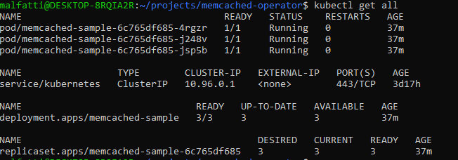

Source: https://developer.ibm.com/learningpaths/kubernetes-operators/develop-deploy-simple-operator/create-operator/

For developers who understand what Kubernetes operators are and how they work, the next step is to build and deploy one yourself. Follow the steps in this tutorial to develop and deploy a Memcached Operator to Red Hat OpenShift. In this tutorial, you will learn the basic concepts and steps needed to develop a Golang-based operator to manage Kubernetes resources.

## Prerequisites
This tutorial assumes that you have some knowledge of Kubernetes operators concepts but little or no experience developing operators. If you need a refresher, read Intro to Kubernetes Operators.

Important: If you haven’t set up your environment for building Kubernetes operators, see these installation instructions.

Note: This tutorial is inspired by the Operator SDK tutorial. Thanks to the Operator SDK team for a great tutorial!

### Step 1: Create a new project using the Operator SDK

1. Check your Go version. This tutorial is tested with the following Go version:

```
 $ go version
 $ go version go1.15.6 darwin/amd64
```

2. Next, create a directory where you will hold your project files:

```
 $ mkdir $HOME/projects/memcached-operator
 $ cd $HOME/projects/memcached-operator
```


Note: Before your run the operator-sdk init command, your memcached-operator directory must be completely empty, otherwise KubeBuilder will complain with an error. This means you can’t have a .git folder, etc.

3. Run the operator-sdk init command to create a new memcached-operator project:

```
 $ operator-sdk init --domain=example.com --repo=github.com/example/memcached-operator
```


- The --domain flag is used to uniquely identify the operator resources that this project creates.
- The example.com domain is used as part of the Kubernetes API group. When you use the command oc api-resources later, the example.com domain will be listed there by your memcached in the APIGROUP category.

### Set up your Go modules
You must set up your Go modules properly to develop and run your operator. The --repo flag sets the name to use for your Go module, which is specified at the top of your go.mod file:

```
module github.com/example/memcached-operator
```

Setting up your Go module enables you to work outside of your GOPATH, as long as the working directory of the project is the same as the name of the module in the top of the go.mod file.

1. Make sure that your directory is called memcached-operator and that your go.mod file shows the following Go module:

```
 module github.com/example/memcached-operator
```


2. For Go modules to work properly, activate Go module support by running the following command:

```
 $ export GO111MODULE=on
```


3. Verify that Go module support is turned on by issuing the following command and ensuring you get the same output:
 ```
 $ echo $GO111MODULE
 on
 ```


You should now have the basic scaffold for your operator, such as the bin, config, and hack directories, as well as the main.go file that initializes the manager.

### Step 2: Create an API and custom controller
This section shows you how to use the operator-sdk create api command to create an API, which will be in your api directory, and a blank custom controller file, which will be in your controllers directory.

Use the --group, --version, and --kind flags to pass in the resource group and version. These 3 flags together form the fully qualified name of a Kubernetes resource type. This name must be unique across a cluster.
```
$ operator-sdk create api --group=cache --version=v1alpha1 --kind=Memcached --controller --resource
Writing scaffold for you to edit...
api/v1alpha1/memcached_types.go
controllers/memcached_controller.go
```

- The --group flag defines an API Group in Kubernetes. It is a collection of related functionality.
- Each group has one or more versions, which allows you to change how an API works over time. This is what the --version flag represents.
- Each API group-version contains one or more API types, called Kinds. This is the name of the API type that you are creating as part of this operator.
- There are more nuances to versioning that we will not cover here. Read more about groups, versions, kinds, and resources in this KubeBuilder reference.
- The --controller flag signifies that the SDK should scaffold a controller file.
The --resource flag signifies that the SDK should scaffold the schema for a resource.

Once you deploy this operator, you can use kubectl api-resources to see the name cache.example.com as the api-group, and Memcached as the Kind. You can try this command later after you deploy the operator.

### Step 3: Update the API
Defining an API is one of the two main parts of the operator pattern. Defining your API creates your custom resource definition (CRD) and is done in the api/v1alpha1/memcached_types.go file.

First, you need to understand the struct that defines your schema. Note that it implements the Object interface, which means it is a Kubernetes object. Also, it has the Spec and Status fields.

```
type Memcached struct {
    metav1.TypeMeta   `json:",inline"`
    metav1.ObjectMeta `json:"metadata,omitempty"`

    Spec   MemcachedSpec   `json:"spec,omitempty"`
    Status MemcachedStatus `json:"status,omitempty"`
}
```

#### What is the Spec?
The MemcachedSpec struct, referenced as the Spec, defines the desired state of the resource. A good way to think about Spec is that any inputs (values tweaked by the user) to your controller go in the Spec section. The controller code references the Spec section to determine how many replicas to deploy.

#### What is the Status?
The MemcachedStatus struct, referenced as the Status, defines the current, observed state of the resource. The status contains information that users or other controllers can easily obtain. The status is updated in the controller code, which updates the current state of the cluster.

The MemcachedStatus struct and the MemcachedSpec struct each has its own fields to describe the observed state and the desired state, respectively.

1. Add a Size int32 field to your MemcachedSpec struct, along with the JSON-encoded string representation of the field name, in lowercase. See Golang’s JSON encoding page for more details.

In this example, since Size is the field name and the JSON encoding must be lowercase, it would look like json:"size".

Add the following to your struct:
```
type MemcachedSpec struct {
     // INSERT ADDITIONAL SPEC FIELDS - desired state of cluster
     // Important: Run "make" to regenerate code after modifying this file

     // Foo is an example field of Memcached. Edit Memcached_types.go to remove/update
     Size int32 `json:"size"`
 }
 ```

 When you create a custom resource later, you will need to fill in the size, which is the number of Memcached replicas you want as the desired state of your system.

 2. Add a Nodes []string field to your MemcachedStatus struct, as shown here:

``` 
 // MemcachedStatus defines the observed state of Memcached
 type MemcachedStatus struct {
     // INSERT ADDITIONAL STATUS FIELD - define observed state of cluster
     // Important: Run "make" to regenerate code after modifying this file
   Nodes []string `json:"nodes"`
 }
``` 
The MemcachedStatus struct uses a string array to list the name of the Memcached pods in the current state.

Lastly, the Memcached struct has the fields Spec and Status to denote the desired state (spec) and the observed state (status). At a high level, when the system recognizes that there is a difference in the spec and the status, the operator uses custom controller logic defined in the controllers/memcached_controller.go file to update the system to achieve the desired state.

### Output and code explanation
Now that you’ve modified the file api/v1alpha1/memcached_types.go, it should look like the file in the artifacts directory:

```
package v1alpha1

import (
    metav1 "k8s.io/apimachinery/pkg/apis/meta/v1"
)

// EDIT THIS FILE!  THIS IS SCAFFOLDING FOR YOU TO OWN!
// NOTE: json tags are required.  Any new fields you add must have json tags for the fields to be serialized.

// MemcachedSpec defines the desired state of Memcached
type MemcachedSpec struct {
    // INSERT ADDITIONAL SPEC FIELDS - desired state of cluster
    // Important: Run "make" to regenerate code after modifying this file

    // Foo is an example field of Memcached. Edit Memcached_types.go to remove/update
    Size int32 `json:"size"`
}

// MemcachedStatus defines the observed state of Memcached
type MemcachedStatus struct {
    // INSERT ADDITIONAL STATUS FIELD - define observed state of cluster
    // Important: Run "make" to regenerate code after modifying this file
    Nodes []string `json:"nodes"`
}

// +kubebuilder:object:root=true
// +kubebuilder:subresource:status

// Memcached is the Schema for the memcacheds API
type Memcached struct {
    metav1.TypeMeta   `json:",inline"`
    metav1.ObjectMeta `json:"metadata,omitempty"`

    Spec   MemcachedSpec   `json:"spec,omitempty"`
    Status MemcachedStatus `json:"status,omitempty"`
}

// +kubebuilder:object:root=true

// MemcachedList contains a list of Memcached
type MemcachedList struct {
    metav1.TypeMeta `json:",inline"`
    metav1.ListMeta `json:"metadata,omitempty"`
    Items           []Memcached `json:"items"`
}

func init() {
    SchemeBuilder.Register(&Memcached{}, &MemcachedList{})
}
```

Above type Memcached struct, there are two lines of code starting with +kubebuilder — note that they are actually commented out. They are important because they provide additional information to the controller-tools. For example, this line:

```
// +kubebuilder:object:root=true
```

tells the object generator that this type represents a Kind. The generator then implements the runtime.Object interface for you, which all Kinds must implement.

And this line:
```
// +kubebuilder:subresource:status
```
Show more
adds the status subresource in the custom resource definition. If you run make manifests, it generates YAML under config/crds/<kind_types.yaml. It also adds a subresources section like so:
```
subresources:
    status: {}
```

The next section shows you how to get and update the status subresource in the controller code.

The key thing to know here is that each of these markers, starting with // +kubebuilder, generate utility code (such as role-based access control) and Kubernetes YAML. When you run make generate and make manifests, your KubeBuilder Markers are read in order to create RBAC roles, CRDs, and code. Read more about KubeBuilder markers.


### Step 4: Implement the controller logic

Note: If you want to learn more in depth about the controller logic, please see our accompanying article, [Deep dive into Memcached Operator Code](https://developer.ibm.com/learningpaths/kubernetes-operators/develop-deploy-simple-operator/deep-dive-memcached-operator-code/).

Now that the API is updated, the next step is to implement the controller logic in controllers/memcached_controller.go.

Copy the code from the [artifacts/memcached_controller.go file](https://github.com/IBM/create-and-deploy-memcached-operator-using-go/blob/main/artifacts/memcached_controller.go), and replace your current controller code.

### Create CRD and RBAC
The generated code from the operator-sdk creates a Makefile. This Makefile allows you to use the make command to compile your go operator code.

1. Now that your controller code and API are implemented, run the following command to implement the required Go type interfaces:
```
 $ make generate
```
This command updates your api/v1alpha1/zz_generated.deepcopy.go file to implement the metav1.Object and runtime.Object interfaces. This enables your custom resource to be treated like a native Kubernetes resource.

2. After the code is generated for your custom resource, you can use the make manifests command to generate CRD manifests and RBAC from KubeBuilder Markers:
```
 $ make manifests
```
This command invokes controller-gen to generate the CRD manifests at config/crd/bases/cache.example.com_memcacheds.yaml. You can see the YAML representation of the object you specified in your _types.go file. It also generates RBAC YAML files in the config/rbac directory based on your KubeBuilder markers.

Don’t worry about KubeBuilder Markers for now — we cover them in an upcoming article.

### Compile your operator
To compile the code, run the following command in the terminal from your project root:
``` 
make install
``` 

### Set the operator namespace
Now you need to update your config to tell your operator to run in your own project namespace. Do this by issuing the following kustomize commands:
``` 
$ export IMG=docker.io/<username>/memcached-operator:<version>
$ export NAMESPACE=<oc-project-name>

$ cd config/manager
$ kustomize edit set image controller=${IMG}
$ kustomize edit set namespace "${NAMESPACE}"
$ cd ../../

$ cd config/default
$ kustomize edit set namespace "${NAMESPACE}"
$ cd ../../
``` 
<username> is your Docker Hub (or Quay.io) username, and <version> is the version of the operator image you will deploy. Note that each time you make a change to your operator code, it is good practice to increment the version. NAMESPACE is the oc project name where you plan to deploy your operator. For us, this is memcache-demo-project.

For example, our export statements would look like the following:
``` 
$ export IMG=docker.io/horeaporutiu/memcached-operator:latest
$ export NAMESPACE=memcache-demo-project
``` 

### Build and push your image
Note: You will need to have an account for an image repository like Docker Hub to be able to push your operator image. Use Docker login to log in.

1. To build the Docker image, run the following command. Note that you can also use the regular docker build -t command to build as well.
```
 $ make docker-build IMG=$IMG
```
2. Push the Docker image to your registry using the following from your terminal:
```
 $ make docker-push IMG=$IMG
 ```

### Step 6: Deploy the operator to your OpenShift cluster
1. To deploy the operator, run the following command from your terminal:
```
 $ make deploy IMG=$IMG
```
The output of the deployment should look like the following:
```
 ...go-workspace/src/memcached-operator/bin/controller-gen "crd:trivialVersions=true,preserveUnknownFields=false" rbac:roleName=manager-role webhook paths="./..." output:crd:artifacts:config=config/crd/bases
 cd config/manager && ...go-workspace/src/memcached-operator/bin/kustomize edit set image controller=sanjeevghimire/memcached-operator:v0.0.5
 .../go-workspace/src/memcached-operator/bin/kustomize build config/default | kubectl apply -f -
 Warning: kubectl apply should be used on resource created by either kubectl create --save-config or kubectl apply
 namespace/sanjeev-operator-prj configured
 customresourcedefinition.apiextensions.k8s.io/memcacheds.cache.example.com configured
 role.rbac.authorization.k8s.io/memcached-operator-leader-election-role created
 clusterrole.rbac.authorization.k8s.io/memcached-operator-manager-role configured
 clusterrole.rbac.authorization.k8s.io/memcached-operator-metrics-reader unchanged
 clusterrole.rbac.authorization.k8s.io/memcached-operator-proxy-role unchanged
 rolebinding.rbac.authorization.k8s.io/memcached-operator-leader-election-rolebinding created
 clusterrolebinding.rbac.authorization.k8s.io/memcached-operator-manager-rolebinding configured
 clusterrolebinding.rbac.authorization.k8s.io/memcached-operator-proxy-rolebinding configured
 configmap/memcached-operator-manager-config created
 service/memcached-operator-controller-manager-metrics-service created
 deployment.apps/memcached-operator-controller-manager created
```
To make sure everything is working correctly, use the oc get pods command:
```
 $ kk get pods

 NAME                                                     READY   STATUS    RESTARTS   AGE
 memcached-operator-controller-manager-54c5864f7b-znwws   2/2     Running   0          14s
```
This means your operator is up and running. Great job!

### Step 7: Create the custom resource
Next, let’s create the custom resource.

1. Update your custom resource by modifying the config/samples/cache_v1alpha1_memcached.yaml file to look like the following:
```
 apiVersion: cache.example.com/v1alpha1
 kind: Memcached
 metadata:
   name: memcached-sample
 spec:
   # Add fields here
   size: 3
```
Note the only change was to set the size of the Memcached replicas to be 3.

Finally, create the custom resources using the following command:
```
 $ kubectl apply -f config/samples/cache_v1alpha1_memcached.yaml
 ```

 ### Verify that resources are running
 1. From the terminal, run kubectl get all or oc get all to make sure that the controllers, managers, and pods have been successfully created and are in Running state with the right number of pods as defined in the spec:
``` 
 $ kubectl get all
 ``` 
 Here’s what the output should look like:
 

 ### Step 8: Test and verify

 1. Update config/samples/<group>_<version>_memcached.yaml to change the spec.size field in the Memcached CR. This increases the application pods from 3 to 5. 

2. Next, verify that your pods have scaled up. Run the following command:
``` 
 $ kubectl get pods
``` 
You should now see that there are 5 total memcached-sample pods.

### Cleanup
The Makefile part of the generated project has a target called undeploy, which deletes all the resources associated with your project. It can be run as follows:
``` 
$ make undeploy
``` 